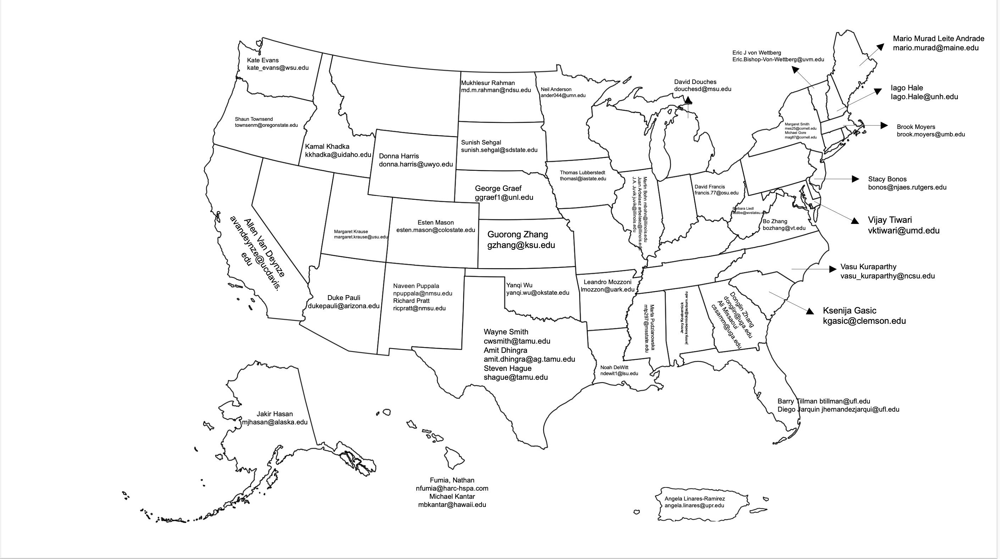

Plant breeding is essential to the long-term sustainability of agricultural production to supply a burgeoning global population with food, feed, fiber, fuel, green space, and shelter presents an unprecedented challenge, particularly in the face of climate change and heightened competition for diminishing land, water, and nutrient resources. The public sector has a long history of Plant Breeding, in the United States plant breeding has been an institutional staple since the Morrill act of 1862.

Established in 2006, the PBCC continues this history and helps coordinate the role of the public sector in continuing investment in Plant Breeding capacity and infrastructure, as the time-scale of germplasm conservation and evaluation, population development, and selection is long-term endeavor. Part of the mandate was to establish (in cooperation with Industry) common educational standards and help create a space where those with common research interests can meet to reach common goals. The PBCC facilitates ongoing discussion on the needs of the Plant Breeding community and in particular, what public sector breeders and breeding students can do to meet the challenges of the future.

### Representatives

<link rel="stylesheet" href="assets/css/us-breeding-map.css">

